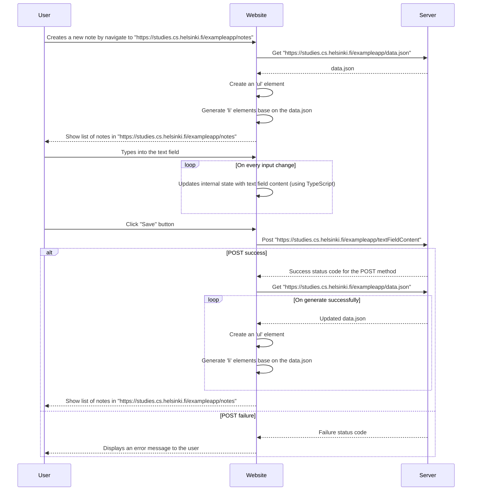

```mermaid
sequenceDiagram
    participant User
    participant Website
    participant Server

    User->>Website: Creates a new note by navigate to "https://studies.cs.helsinki.fi/exampleapp/notes"
    Website->>Server: Get "https://studies.cs.helsinki.fi/exampleapp/data.json"
    Server-->>Website: data.json
    Website->>Website: Create an 'ul' element
    Website->>Website: Generate 'li' elements base on the data.json
    Website-->>User: Show list of notes in "https://studies.cs.helsinki.fi/exampleapp/notes"
    User->>Website: Types into the text field
    loop On every input change
        Website->>Website: Updates internal state with text field content (using TypeScript)
    end
    User->>Website: Click "Save" button
    Website->>Server: Post "https://studies.cs.helsinki.fi/exampleapp/textFieldContent"
    alt POST success
        Server-->>Website: Success status code for the POST method
        Website->>Server: Get "https://studies.cs.helsinki.fi/exampleapp/data.json"
       loop On generate successfully
             Server-->>Website: Updated data.json
            Website->>Website: Create an 'ul' element
            Website->>Website: Generate 'li' elements base on the data.json
        end
        Website-->>User: Show list of notes in "https://studies.cs.helsinki.fi/exampleapp/notes"
    else POST failure
        Server-->>Website: Failure status code
        Website-->>User: Displays an error message to the user
    end
```
