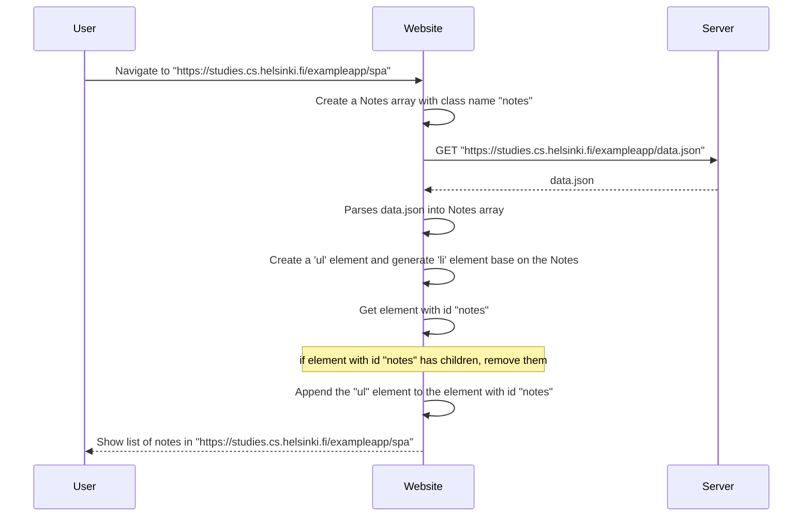

```mermaid
sequenceDiagram
    participant User
    participant Website
    participant Server

    User->>Website: Navigate to "https://studies.cs.helsinki.fi/exampleapp/spa"
    Website->>Website: Create a Notes array with class name "notes"
    Website->>Server: GET "https://studies.cs.helsinki.fi/exampleapp/data.json"
    Server-->>Website: data.json
    Website->>Website: Parses data.json into Notes array
    Website->>Website: Create a 'ul' element and generate 'li' element base on the Notes
    Website->>Website: Get element with id "notes"
    Note over Website,Website: if element with id "notes" has children, remove them
    Website->>Website: Append the "ul" element to the element with id "notes"
    Website-->>User: Show list of notes in "https://studies.cs.helsinki.fi/exampleapp/spa"
```
